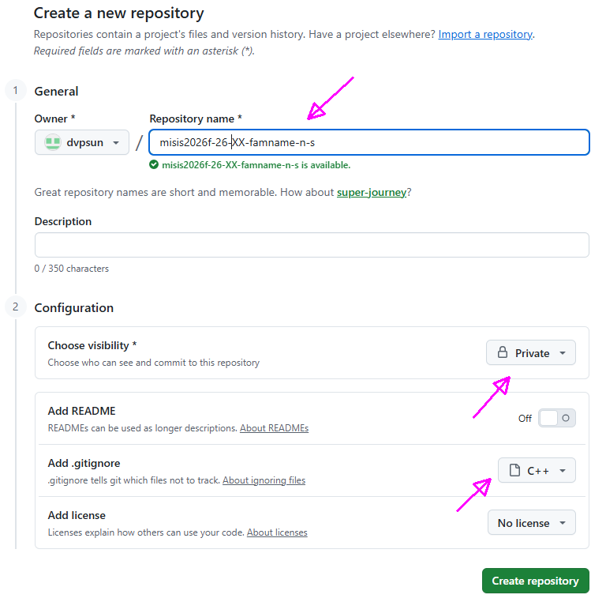

# Программирование и алгоритмизация (МИСИС, 2026-осень)

## неделя 01

### задачи (условия)
[4A Арбуз](./docs/0004a.md)  
[617A Слоник](./docs/0617a.md)  
[271A Красивый год](./docs/0271a.md)  

### ДЗ

1. разберите решения из [папки](./prj.codeforces/) и научитесь писать сами код такого типа
2. завести профиль на github  
3. создать приватное хранилище (repository) с именем вида misis2026f-26-XX-famname-n-s, где  
  . XX - значащие цифры номера группы с ведущим нулем (например 01 или 16)  
  . famname-n-s - ваша фамилия и инициалы латиницей в нижнем регистре  
    
  . явно укажите для .gitignore шаблон для C++  
4. попробуйте добавить папки и файлы с решениями задач  
  . решение задач с codeforces добавляйте в папку /prj.codeforces  
  . имена файлов по номеру (с ведущими нулями) и букве (латиница строчная)  
5. заполните форму https://forms.gle/XfbSAbMff8Uqiwh88  

<!--
## неделя 02 (условия)
### задачи
[263A Красивая матрица](./docs/0263a.md)  
-->

# Инструменты

## IDE - что потребуется и откуда ставить

### CMake

. [скачайте](https://cmake.org/download/) и установите CMake для вашей операционной системы  
. проверьте, что утилита запускается в консоли 
  ```
  cmake --version
  ```

### Microsoft Visual Studio (Windows)

. IDE - [Visual Studio Community 2026](https://visualstudio.microsoft.com/ru/downloads/#visual-studio-community-2026)  
. потребуется поставить правильные оснастки


### Visual Studio Code (Cross Platform)

. IDE (см. под вашу платформу) - [Visual Studio Code](https://code.visualstudio.com/)  
. плагины - [C/C++ Extension Pack (Microsoft)](https://marketplace.visualstudio.com/items?itemName=ms-vscode.cpptools-extension-pack)  
. Windows инструменты сборки - [Build Tools for Visual Studio 2026](https://visualstudio.microsoft.com/ru/downloads/#build-tools-for-visual-studio-2026)  
. xNix инструменты сборки - gcc и/или Clang  
